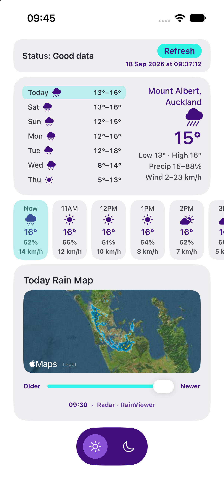
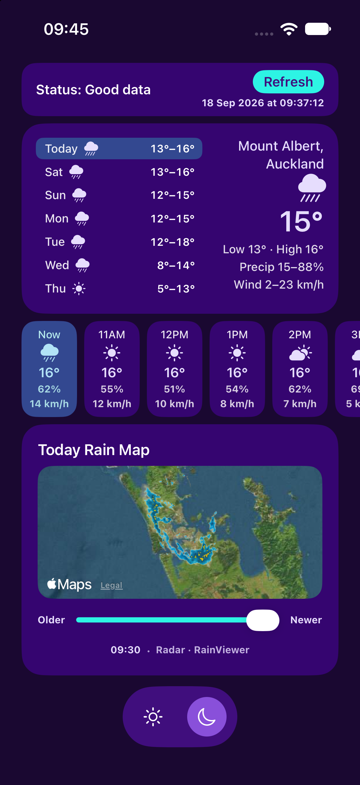

# Spark Satellite Weather (iOS)

Spark Satellite Weather is a **weather demo app**: it shows current conditions, a 7‑day forecast with hourly breakdown, and a rain radar map for your location. The app’s main purpose is to demonstrate **satellite (connection-aware) behaviour**. When the network is **low** (e.g. ultra-constrained or simulated), the app shows **"Status: Low data"** in the status bar—for example the rain map is only loaded when status is Good data. All weather and radar data use the **device location**; there is no fallback if location is unavailable.

## Table of contents

- [Screenshots](#screenshots)
- [How to use the app](#how-to-use-the-app)
- [Satellite connectivity in development and testing](#satellite-connectivity-in-development-and-testing)
- [Requirements](#requirements)
- [Installation](#installation)
- [Documentation](#documentation)
- [Project structure (connectivity and location)](#project-structure-connectivity-and-location)
- [License](#license)

## Screenshots

**Light and dark themes** — Spark appearance.

<p align="center">
  
  &nbsp;
  
</p>

## How to use the app

1. Run the app on a simulator or device (**⌘R**).
2. Grant **location** permission when prompted.
3. The app loads weather for the current location. Use **Refresh** to update.
4. Select a day in the list to see that day’s details and the hourly strip. When connection is **good**, use the rain map (StormMapView) to scrub through radar frames; when low or none, the rain map section shows a placeholder.
5. Tap **sun** or **moon** in the bottom tab bar to switch between light and dark themes.

## Satellite connectivity in development and testing

- **What you see:** The status bar shows **"Status: Good data"** / **"Status: Low data"** / **"Status: No data"**, aligned with what you get: full map and forecast (Good), reduced e.g. no rain map (Low), or minimal data (No).
- **iPhone, iOS 26.4+, and real satellite HTTP:** Weather requests use **`NetworkURLSessionHTTPClient`**, which sets **`URLSessionConfiguration.allowsConstrainedNetworkAccess`** and **`allowsExpensiveNetworkAccess`**, and on **iOS 26.4 and later** also **`allowsUltraConstrainedNetworkAccess = true`** so Open-Meteo can run over Spark / satellite paths when the system allows it. Build with **Xcode 26.4+** (verified on **Xcode 27**) so that API is available; you still need the **carrier-constrained entitlements** and App ID capability described in **[docs/SATELLITE.md](docs/SATELLITE.md)**.

```swift
if #available(iOS 26.4, *) {
    configuration.allowsUltraConstrainedNetworkAccess = true
}
```

- **How to see "Status: Low data" on real hardware:** Use a network that the system reports as ultra-constrained (e.g. certain cellular or satellite links when `NWPath.isUltraConstrained` is true). The app then shows "Status: Low data".
- **Testing locally without special hardware — launch argument:** You can **simulate** a constrained path so you don’t need real hardware. In Xcode: **Edit Scheme → Run → Arguments → Arguments Passed On Launch**, add:
  - **`-SimulateConstrainedPath`** and **`low`** — to always show "Status: Low data" and the placeholder rain map.
  - **`-SimulateConstrainedPath`** and **`none`** — to simulate no connection.
  - **`-SimulateConstrainedPath`** and **`good`** — to force good connection.
  Run the app; with **`low`** the status bar will show "Status: Low data", and the rain map will show a placeholder. This is the recommended way to test satellite behaviour during development or in CI.
- **How behaviour changes:** When **good**, the rain map (radar) is loaded; when **low** or **none**, the rain map section shows a placeholder. When **none**, the app fetches minimal weather (no hourly).
- **Connectivity and location:** Connectivity is observed via **NWPathMonitor** (good / low / none); the **`-SimulateConstrainedPath`** argument overrides the real path for testing. Location is used for weather and radar; see [docs/SATELLITE.md](docs/SATELLITE.md) for how connectivity and location are implemented.

## Requirements

- **Xcode** — **26.4 or newer** for Spark satellite and **`allowsUltraConstrainedNetworkAccess`** (see above). Verified on **Xcode 27** / iOS 27 SDK; no project changes required to open or run.
- **iOS** — Deployment target remains **iOS 26+** (runs on iOS 27). **iOS 26.4+** on device is the recommended baseline for Spark satellite with the ultra-constrained URLSession path.
- **Location permission** — For weather and rain map.

## Installation

1. Clone the repository (or download the source).
2. Open **`SparkSatelliteWeather.xcodeproj`** in Xcode.
3. Select a simulator or device and run (**⌘R**).

## Documentation

- **[docs/SATELLITE.md](docs/SATELLITE.md)** — What “satellite” means here, how to see it and test it (including **`-SimulateConstrainedPath`**), how connectivity and location are implemented, and how to build an app with satellite behaviour (see the "Building an app with satellite" section in that doc).

## Project structure (connectivity and location)

| Path | Purpose (satellite / connectivity / location) |
|------|-----------------------------------------------|
| `Connectivity.swift` | Connectivity enum (good/low/none); **`Connectivity(networkPath:)`** respects **`-SimulateConstrainedPath good\|low\|none`** for testing. See [docs/SATELLITE.md](docs/SATELLITE.md). |
| `Connectivity+Display.swift` | Display helpers: description ("Status: Good/Low/No data"). |
| `ViewModel.swift` | **WeatherViewModel**: **NetworkPathServiceObserver**; holds **connectivity**, updated in **networkPathDidUpdate(with:)**. Rain map only when **.good**; minimal vs full weather when **.none**. |
| `ContentView.swift` | Main weather UI; status bar, forecast, hourly strip, rain map section; theme toggle. |
| `SparkTheme.swift` | Spark design tokens (`SparkColors`), spacing, radius, typography; light/dark palettes. |
| `StormMapView.swift` | Rain map UI (MapKit + RainViewer overlay); used when connection is good. |
| `LocationService.swift` | Core Location and reverse geocoding for weather and radar. |
| `networking/NetworkPathService.swift` | **NWPathMonitor**; notifies WeatherViewModel when path changes. |
| `networking/NetworkURLSessionHTTPClient.swift` | Weather HTTP: constrained / expensive / **ultra-constrained** (`allowsUltraConstrainedNetworkAccess` on **iOS 26.4+**) for Spark satellite paths. |

Other modules (e.g. `networking/WeatherAPI.swift`, `RainViewerAPI.swift`) handle APIs; see the source and [docs/SATELLITE.md](docs/SATELLITE.md) for the full flow.

## License

This project is licensed under the Apache License 2.0 — see [LICENSE](LICENSE) for details.
